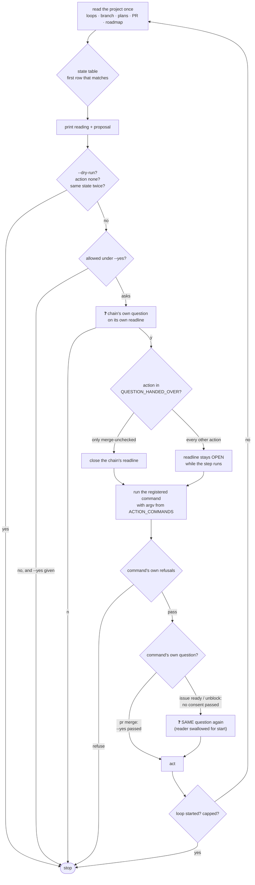
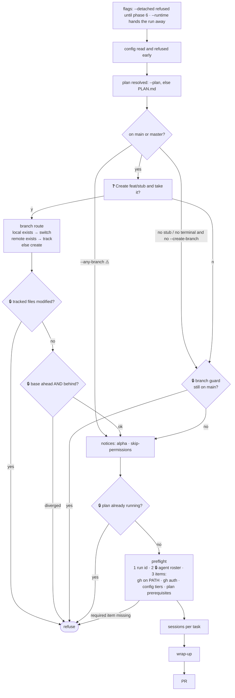
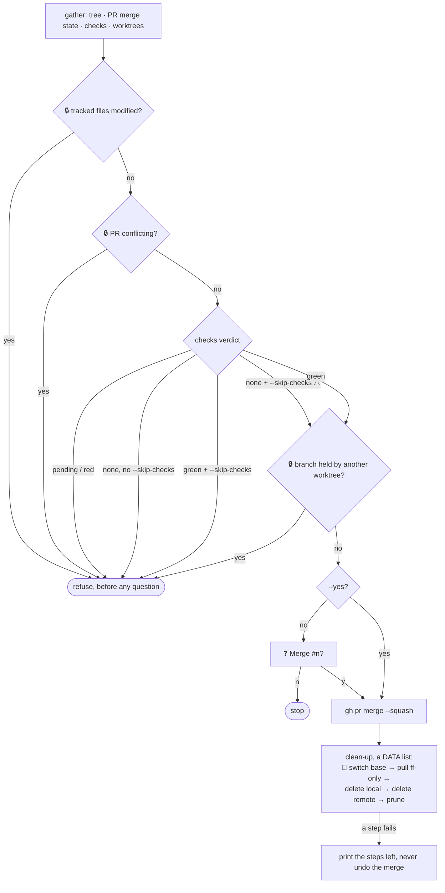
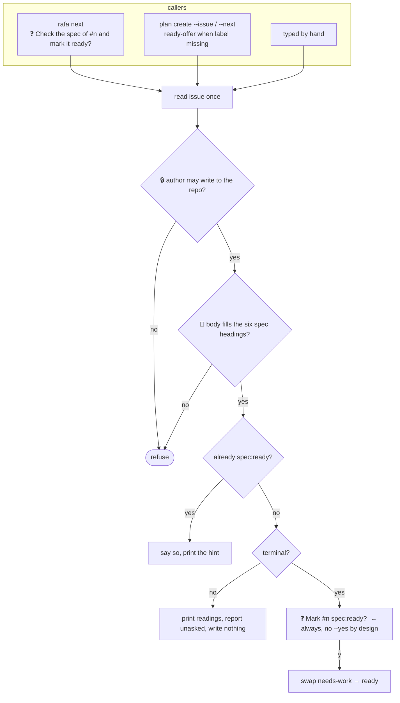
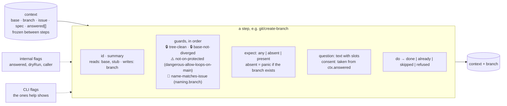
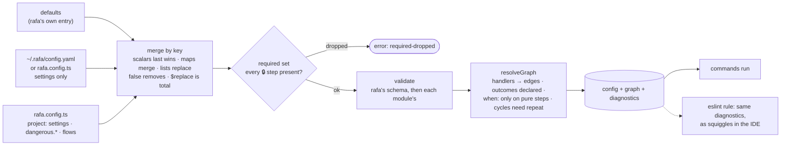
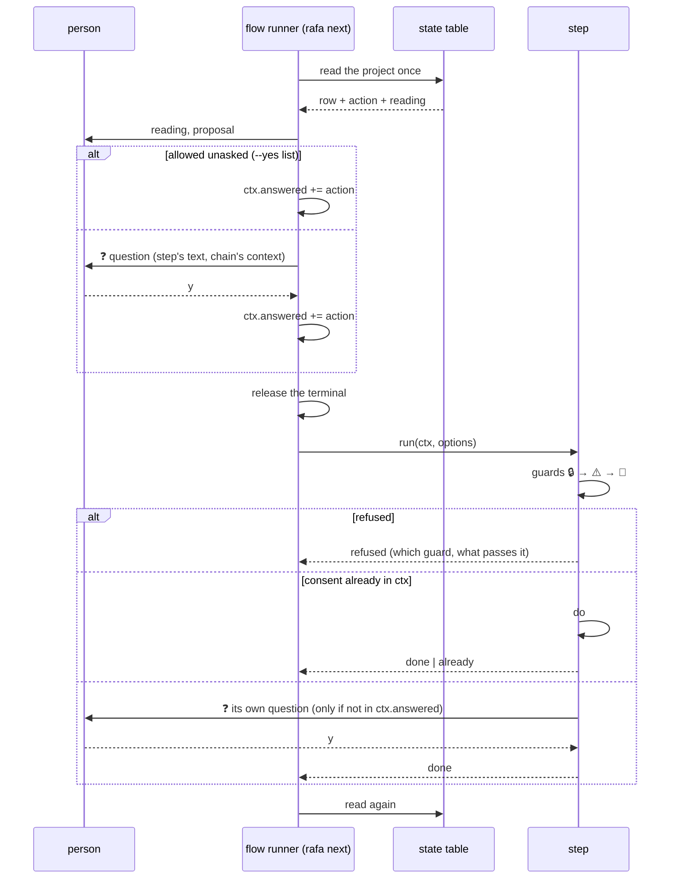
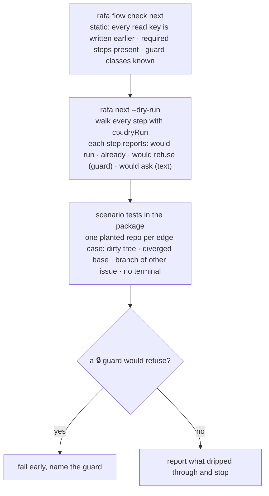
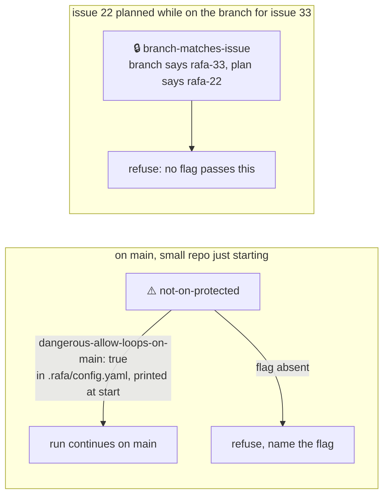

# Workflow checks: how they run today, and how they would run as steps

A design document behind #118 (config as code), #119 (the step contract) and #120 (the
fixture harness), and the amendment to #71. The "today" sections were read at `a05e94a`
(rafa-82 merged); the "proposed" sections are what those issues specify.

Four commands are drawn, because they are the
ones the chain runs and the ones that own the most checks: `rafa next`, `loop start`,
`pr merge`, `issue ready`. The rest follow the same shapes.

Legend for every diagram: 🔒 a check nothing can turn off · ⚠️ a check a
`dangerous-*` flag can pass · 🧭 a check that is our workflow, a setting for others ·
❓ a question put to the person.

---

## 1. Today: `rafa next` is a chain that owns the terminal



What is coupled here, in one sentence each:

- **Consent is per action, spelled in argv** (`src/next/actions.ts`): `merge` gets `--yes`, `ready` and `unblock` get nothing, so the person answers twice. The chain cannot say "I already asked" in any way the step understands.
- **The terminal is the chain's** (`src/commands/next.ts:217`): one step out of nine gets it back. Any other step that reads stdin, or spawns something that does, reads nothing.
- **The chain knows the commands' flags by name.** Add a flag to `pr merge` and the chain's table must learn it; the chain and the command drift in two files.

## 2. Today: `loop start` runs its guards inline, in one function



Coupled:

- **The branch offer and the branch guard are two units that must agree** (`start/branch-decision.ts` vs. the guard in `start.ts`): the offer stands aside three ways and lets the guard "have the last word". Two places, one decision.
- **`--any-branch` outranks `--create-branch` by code order**, not by declaration. Nothing says which flags are escape hatches.
- **The step order is the function's line order** (`src/start.ts`, 230 lines). #71 already records this: 23 steps, 17 named, 6 inline, no registry.

## 3. Today: `pr merge` — the one command already half step-shaped



This is the shape the proposal generalises: refusals are a pure reading over gathered
inputs, the clean-up is a list, a failure prints the remaining list. What it lacks: the
clean-up steps are 🧭 policy (`pr.deleteBranch` in #71) but cannot be dropped; `--yes`
is a CLI flag doing an internal flag's job.

## 4. Today: `issue ready` — asked from three places



Coupled: the step is right to own its question (marking ready is a person's decision),
but it has **no way to be told "a person already said yes to exactly this"**. So the
chain's question and the step's are two prompts for one consent.

## 5. The coupling, in one table

| Check | Class | Lives in | Also re-implemented or assumed in |
| --- | --- | --- | --- |
| tracked files modified | 🔒 | `branch-decision.ts` `treeRefusal` | `pr/merge.ts` (own reading), `next/state.ts` row `tree-modified` |
| on `main`/`master` | ⚠️ `--any-branch` | guard in `start.ts` | offer in `branch-decision.ts` stands aside for it |
| base diverged from remote | 🔒 | `branch-decision.ts` | `next/state.ts` row `base-behind` (sync), `pr/merge.ts` pull ff-only |
| branch of a different issue than the one planned | — **not checked anywhere today** | — | the recipe-for-conflict case from the request |
| PR conflicting / checks red / no checks | 🔒 · ⚠️ `--skip-checks` | `pr/merge.ts` | `next/state.ts` rows `pr-pending`, `pr-red`, `pr-no-checks` |
| branch held by another worktree | 🔒 | `pr/merge.ts` | — |
| plan already running | 🔒 | `start.ts` | `next/state.ts` row `loop-running` |
| agent roster resolves | 🔒 | `start/preflight.ts` | `plan needs` (#56) will read the same |
| author trusted | 🔒 | `board/trust.ts` | readiness gate check 0, `issue ready` |
| spec headings present | 🧭 | `board/readiness.ts` | `issue ready`, `plan create`, template |
| clean-up after merge | 🧭 | `pr/merge.ts` list | `rafa next` assumes it happened |
| branch naming `feat/rafa-n-slug` | 🧭 | `board/naming.ts` | `branch-decision.ts`, `roadmap.ts`, prompt text (#71's table) |
| consent to act | — | argv per action | every step re-asks or does not, by its own rule |

The `rafa next` state table is the third copy of most 🔒 rows: it re-reads what the
commands will refuse on, so it can propose the right thing. That is not wrong — a
proposal has to look before it asks — but today the reading in the table and the refusal
in the command are written twice and tested twice.

---

## 6. Proposed: one step contract, and the checks move into the steps



The rules, each one a line in the spec:

1. **A guard has a class, declared on the step.** 🔒 cannot be passed by anything. ⚠️ names the one `dangerous-*` flag that passes it, and passing it is printed. 🧭 names the setting that changes it. The class is data, so `rafa flow show` can print every guard a flow runs and what turns each off.
2. **A step is idempotent unless told otherwise.** `expect: any` (default) means "the branch exists → `already`, carry on". `expect: absent` means "exists → refused, this is a conflict". The caller says which; the step does not guess.
3. **Consent is a context value, not a flag.** The chain writes `answered: [create-branch]` after its question; the step finds its own id there and does not ask. `--yes` on the CLI just pre-fills the same list. The step still **owns** the question text and the check that it is the right question; the caller may only insert context into it.
4. **Internal flags and CLI flags are two parameters.** A step receives `(ctx, options)`; `dryRun`, `answered`, `caller` ride in `ctx`, and never in argv, so nothing a person types can forge a consent.
5. **Extra context is ignored, not refused.** A step validates the keys it reads and passes the rest through frozen. That is what lets steps be rearranged.
6. **The terminal belongs to the step that is asking**, for as long as it asks. The runner never holds a reader across a step.

## 6b. Proposed: the config is code, and the flow is a graph in it



```ts
// rafa.config.ts
import { defineConfig, defaults } from '@open-tomato/rafa/config';

export default defineConfig([
  defaults,
  {
    naming: { branch: 'feat/{stub}' },
    dangerous: { allowLoopsOnMain: true },        // ⚠️ printed at start
    flows: {
      next: {
        'git/branch-matches-issue': { when: 'before:loop/start', on: { false: 'git/create-issue-branch' } },
        'git/create-issue-branch': {
          expect: 'absent',
          on: { success: 'loop/start', fail: { 'git/branch-exists': {}, 'git/cannot-ff-base': {} } },
        },
        'pr/delete-remote-branch': false,         // 🧭 off; a 🔒 step set false → required-dropped
      },
    },
  },
]);
```

The merge, `$replace`, validation and graph live in `@open-tomato/define-config`, a
dependency-free package that knows nothing about rafa; rafa supplies the schema, the step
registry and the YAML reader.

## 7. Proposed: `rafa next` as a flow over those steps



One question per consent. The state table keeps proposing, but its readings become the
same guard functions the steps run, called once and shared: no third copy.

## 8. Proposed: dry-running a rearranged pipeline



`--dry-run` today prints the two lines and stops (`readDryRun`). In the proposal it walks
the whole flow: what would run, what is already done, what would refuse and on which
guard, what would ask and with what text. Only a 🔒 guard fails early.

## 9. The two examples from the request, drawn as guards



The second one is not checked anywhere today (table in §5); it is the first new guard
the spec adds.

---

## 10. Where this landed on the roadmap

- **The skills work stays next** (#23 → #26). None of the above depends on it, and #23's
  "the right skills reach the right task" is itself a 🧭 policy a flow step carries.
- **After #26, three issues:** #118 config as code on `@open-tomato/define-config`
  (its own public repository, spec at open-tomato/define-config#2), #119 the step contract
  with `rafa next` and `pr merge` moved onto it, #120 the fixture harness. #71 keeps its
  layers 1–3 after #30, with Contract 3 amended to live in `rafa.config.ts`.
- **The three immediate fixes from the incident** are #121, a bug against today's code;
  #119 later replaces the mechanism rather than the fix.

## 11. The statement to users

> rafa ships with our workflow — issue, branch, plan, loop, PR, merge — because we had to
> ship one. The guards that keep you from losing work or merging over a conflict are not
> negotiable, and rafa prints every one it runs. Everything else — the order, what is
> asked, what is deleted, how things are named — is a step you can see, move, or turn
> off, and `--dry-run` shows what your arrangement would do before it does it.
